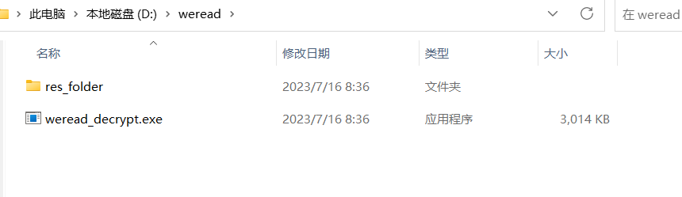
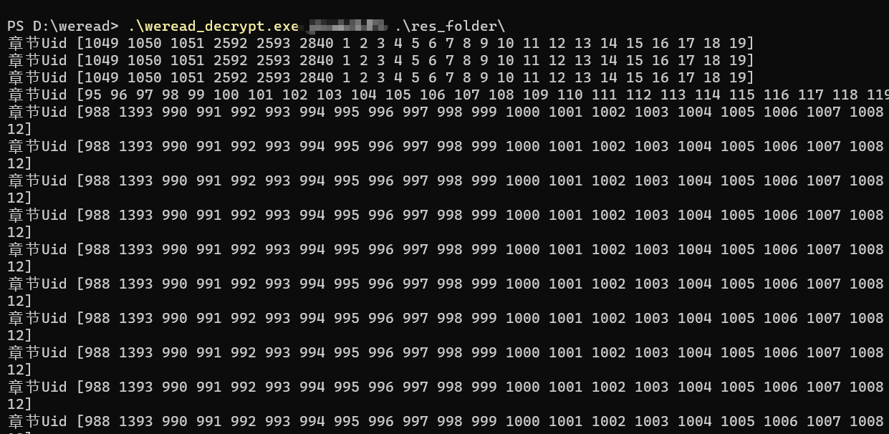
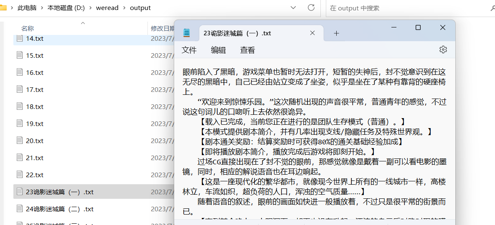
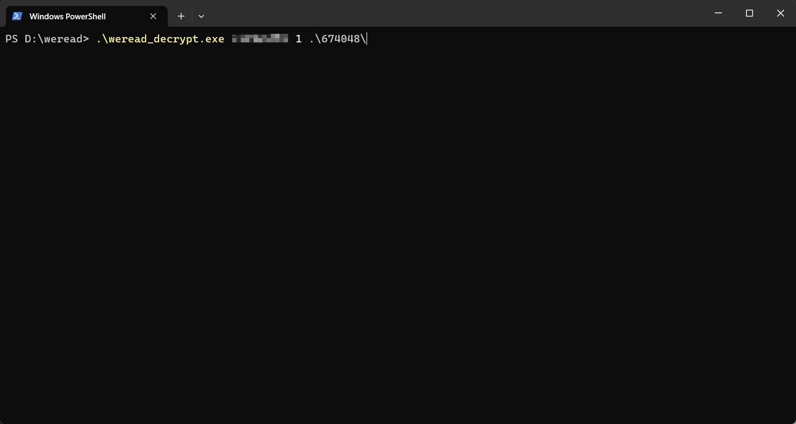
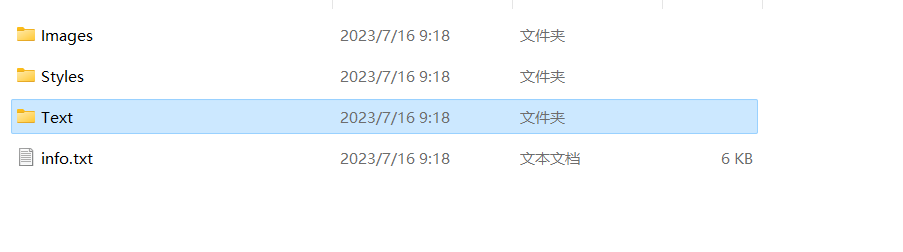
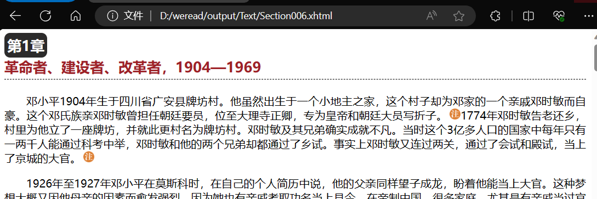

<h1 align="center">微信读书缓存文件解密</h1>

#### 本项目仅供技术研究使用, 请勿用于商业用途!

#### 本项目仅供技术研究使用, 请勿用于商业用途!

#### 本项目仅供技术研究使用, 请勿用于商业用途!

## Introduction

将微信读书下载到本地的缓存进行解密，文件保存在/data/user/0/com.tencent.weread/databases/{一串数字(vid)}/books/{bookId}中,需要手机的 ROOT 权限

## Usage

1. Clone this repo
2. go mod tidy
3. go build
4. ./weread_decrypt.exe [vid] [flag] ["Your .res file folder"] 网文 flag 为 0 写出 txt 文件 实体书 flag 为 1 写出 html 文件
5. Check output folder

## Example

出版书

